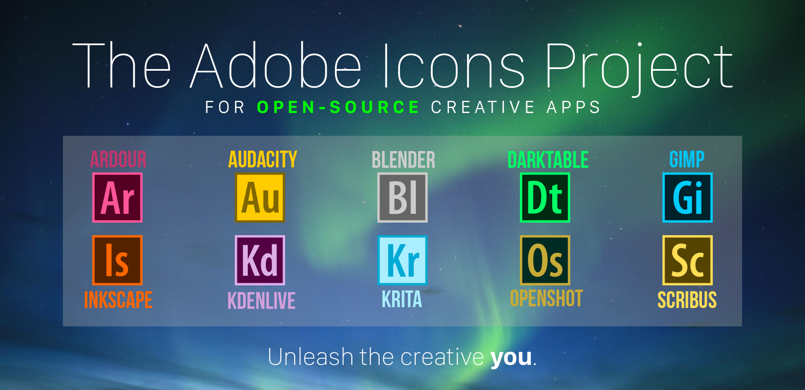

# The Adobe Icons Project
A set of icons inspired by those of Adobe products for open-source, creative applications. This project was previously hosted on DeviantArt.

# Available icons
- GIMP
- Inkscape
- Blender
- Krita
- Audacity
- Scribus
- OpenShot
- Ardour
- Darktable
- Kdenlive

# Instructions
These instructions apply for all the featured apps. However, for the sake of an example, let us start off by changing GIMP's icon.
1) Copy the SVGs to any directory you like. I recommend placing them
in a directory which you're unlikely to mess with. Never rename, move or
delete the icons.
2) Go to `/usr/share/applications`.
3) Right-click on 'GIMP Image Editor' in the directory (or any of the apps
we support for that matter) and select 'Copy'.
4) Open the Terminal and type this:
`sudo gedit "Paste the thing that you copied in Step 3"`
(without the inverted commas)
Hit Enter and type in your password.
5) The .desktop file of the app will open in Gedit.
Just find the line that begins with `'Icon=...'`
6) Go to the directory where you pasted the SVGs.
Right-click on the respective file and select "Copy".
7) Return to Gedit. Go to the line mentioned in Step 5, delete whatever is written in front of `"Icon="` and paste the address of your SVG there.
8) Save the .desktop file.

_These instructions apply for Ubuntu and its derivatives. A quick search will help you get instructions for other Linux distros._

_For Windows and macOS, you'll have to convert the SVG files to ICO and ICNS respectively (GIMP can help with this) and again a quick search will help with the installation._

Designed by **Rohit Awate**
GitHub: @RohitAwate
Twitter: @TheRohitAwate
Email: rohitawate121@gmail.com